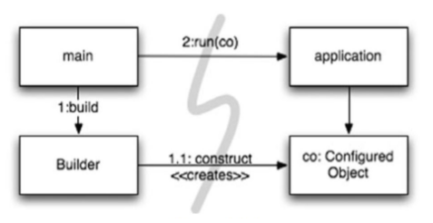
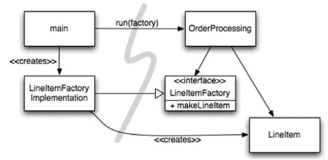

## 시스템 제작과 시스템 사용을 분리하라
- 소프트웨어어 시스템은 다음 두가지를 분리해야 한다.
- 1. 컴파일 과정: 애플리케이션 객체를 제작하고 의존성을 서로 연결하는 준비과정
- 2. 런타임 로직: 애플리케이션이 동작하는 로직
```java
class 컴파일과런타임이_뒤섞여_있는_클래스(){
    // 런타임에 호출되는 메서드
    public Service getService() {
           if(service == null){
               // 의존성 주입은 컴파일 시점에 적용이 되어야 한다.
               service = new ServiceImpl(); 
           }
           return service;
    }
}
```
### Main 분리
- 생성과 관련한 코드는 모두 main이나 main이 호출하는 모듈로 옮기고 
- 나머지 시스템은 모든 객체가 생성되었고 모든 의존성이 연결되었다고 가정하는 방법
- 애플리케이션은 main이나 객체가 생성되는 과정을 알 필요가 없다.



### 팩토리
- 객체가 생성되는 시점을 애플리케이션 결절하는 필요도 있다.
- `LineItem`을 생성하는 시점은 어플리케이션 결정하지만, 생성하는 코드는 애플리케이션 알지 못한다.




### 의존성 주입 (DI)
```text
사용과 제작을 분리하는 가장 강력한 메커니즘 중 하나가 의존성 주입(Dependency Injection, DI)이다. 
의존성 주입은 제어 역전(Inversion of Control, IOC) 기법을 의존성 관리에 적용한 메커니즘이다.
```

```text
제어 역전에서는 한 객체가 맡은 보조 책임을 새로운 객체에게 전적으로 떠넘긴다. 
새로운 객체는 넘겨받은 책임만 수행하면 되므로 SRP(단일 책임 원칙)을 지키게 된다. 즉, 의존성 주입에서는 객체에게 의존성 자체를 인스턴스로 만드는 책임을 주지 않는다. 
이러한 책임을 main 루틴이나 특수 컨테이너와 같은 다른 '전담 매커니즘'에 넘겨서 제어를 역전한다.
```

### 확장
- 관심사를 적절히 분리해 관리한다면 소프트웨어 아키텍처는 점진적으로 발전할 수 있다.

### 횡단 관심사
- 이러한 트랜잭션, 보안, 영속성 등의 관심사를 횡단 관심사로 보고 모듈화하는 방식은 관점은 관점 지향 프로그래밍(Aspect-Oriented Programming, AOP)를 예견했다고 보인다.
- 영속성을 예로 들면 개발자는 영속적으로 저장할 객체와 속성을 선언한 후 영속성 책임은 프레임워크에 위임한다. 
- 그러면 AOP 프레임워크는 대상 코드는 건들지 않고 동작 방식을 변경한다.

## 자바 프록시
- 자바 프로시 실제 구현은 조금 복잡하다.
```java
public class BankImpl implements Bank {

    private List<Account> accounts;

    @Override
    public Collection<Account> getAccounts() {
        return accounts;
    }

    @Override
    public void setAccounts(Collection<Account> accounts) {
        this.accounts = new ArrayList<>();
        for (Account account : accounts) {
            this.accounts.add(account);
        }
    }
}
```
```java
public class BankProxyHandler implements InvocationHandler {

    private Bank bank;

    public BankProxyHandler(Bank bank) {
        this.bank = bank;
    }

    @Override
    public Object invoke(Object proxy, Method method, Object[] args) throws Throwable {

        String methodName = method.getName();
        if (methodName.equals("getAccounts")) {
            //..
            return new ArrayList<>();
        }
        else if (methodName.equals("setAccounts")) {
            //..
            return null;
        }
        return null;
    }
}
```
```java
class BankTest {
    @DisplayName("프록시로 객체를 생성할 수 있다")
    @Test
    void createProxyEntityTest(){
        Bank bank = (Bank) Proxy.newProxyInstance(
                Bank.class.getClassLoader(),
                new Class[]{Bank.class},
                new BankProxyHandler(new BankImpl())
        );

        Collection<Account> accounts = bank.getAccounts();
        assertThat(accounts).isNotNull();
    }
}
```

## 순수 자바 AOP 프레임워크
- 대부분의 프록시 코드는 판박이라 도구로 자동화가 가능하다. 

## AsepectJ 관점
- 언어 차원에서 관점을 모듈화 구성으로 지원하는 자바 언어 확장이다.